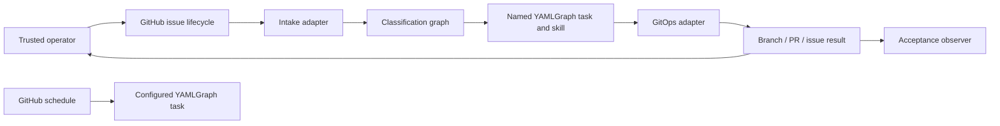

# GitClaw Architecture

**Status:** Target architecture. The current implementation diverges in the
areas listed under Current Divergences.

## Purpose

GitClaw turns a trusted GitHub issue into one named YAMLGraph task and publishes
the task result through GitHub. It is a YAMLGraph integration example, not a
second workflow framework.

This document defines responsibility ownership, allowed dependencies, operation
boundaries, side-effect ownership, and acceptance scope. Implementation details
that contradict these boundaries are defects even when their tests pass.

## Architectural Principles

1. **The issue is the request.** GitHub owns request identity and lifecycle.
   GitClaw does not create a second repository request record.
2. **YAMLGraph classifies.** A small classification graph translates issue
   content into a named operation and its inputs.
3. **Named tasks own semantics.** Plan, Judge, Enforce, Review, Test, and Run are
   separate YAMLGraph tasks using the applicable skills.
4. **Code checks mechanics only.** Deterministic code may verify Git objects,
   paths, process results, credentials, and GitHub side effects. It does not
   judge document meaning or formatting.
5. **Intake does not own Git.** Intake authorizes and invokes. It never creates
   request files, commits, branches, pushes, PRs, or publication comments.
6. **GitOps owns publication.** GitOps receives a completed task result and owns
   branch, commit, push, PR, issue comment, and forward reconciliation.
7. **Acceptance observes.** Acceptance creates an issue, monitors the run, and
   reports the conclusion and changed files. It does not reproduce lifecycle
   logic.
8. **Humans merge implementation.** Reasoning and publication may be automated;
   implementation merge authority remains human.
9. **Cron only schedules.** The configured YAMLGraph task owns its inputs,
   outputs, side effects, and failure semantics.

## System Context



GitHub is the external system of record. YAMLGraph is the semantic execution
engine. GitOps is the only repository-write component. Acceptance is outside
the production lifecycle.

## Components

### GitHub Issue Lifecycle

The issue is the request object. Its repository and number provide stable
identity. Title, body, author, labels, timestamps, edit events, comments,
open/closed state, linked runs, and linked PRs constitute its lifecycle.

An issue edit is a new event in that lifecycle. An execution consumes the issue
snapshot associated with the triggering event and run. Exact diagnostic input
may be retained in GitHub run evidence, but it is not committed into a product
branch.

The issue lifecycle owns:

- request identity and current content;
- operator-visible progress and failure reporting;
- links to produced GitHub artifacts; and
- retry or revision triggers.

It does not own semantic interpretation or Git publication sequencing.

### Intake Adapter

Intake is a thin GitHub event adapter. It:

1. verifies the trusted-trigger policy;
2. reads the issue snapshot from the event/API;
3. invokes the classification graph;
4. invokes the selected named task; and
5. hands the completed task result to GitOps when publication is required.

Intake must not:

- parse operation grammar itself;
- create or commit request files;
- inspect semantic output content;
- configure Git identity;
- switch branches, commit, push, or create PRs; or
- reconcile partial publication.

The workflow may sequence components, but sequencing does not transfer
responsibility into the workflow shell.

### Classification Graph

The classifier is a small YAMLGraph with structured output. Its input is the
issue snapshot. Its output names:

- one supported operation;
- the operation subject or target;
- a PR number when relevant; and
- operator feedback when relevant.

It performs no operation work and no GitHub mutation. Unsupported or ambiguous
classification is reported as an issue-run failure.

The classifier replaces exact-English regex parsing. The public interface is
the operation result, not a hardcoded title grammar.

### Named YAMLGraph Tasks

Each operation is independent and has one semantic owner.

| Operation | Consumes | Produces | Semantic owner |
|---|---|---|---|
| Plan | Issue snapshot | Feature request | Feature-request skill/task |
| Judge | Feature request selected by issue | Judgement | Judge skill/task |
| Enforce | Issue plus selected plan/judgement | Working-tree implementation result | Enforce task and graph-authoring skill where applicable |
| Review | PR head plus selected plan/judgement | Review | Review skill/task |
| Test | PR head | Test command evidence | Test task |
| Run | PR head plus graph path and expected outcome | Lint/run evidence | YAMLGraph run task |

These are ordinary task inputs and outputs. GitClaw does not maintain a
separate artifact-authority classifier. A task validates the semantic
requirements of the artifact it consumes. Human merge is the repository
authority boundary.

Tasks may inspect repository files and produce working-tree changes. They do not
receive repository-write GitHub credentials and do not commit, push, create PRs,
comment, close issues, or merge.

### Semantic Inspection

Skills and models inspect semantics:

- the feature-request skill determines whether a plan is complete;
- the judge determines whether a plan grants implementation scope;
- the enforcer determines implementation consistent with the plan;
- the reviewer determines whether a PR satisfies its governing artifacts.

Deterministic code checks mechanics only:

- process exit status;
- existence and identity of files, commits, branches, and PR heads;
- changed-file lists;
- credential separation;
- GitHub API results; and
- whether an intended side effect completed.

Deterministic code must not enforce Markdown headings, verdict wording,
first-line formats, or semantic combinations of paths. Those checks duplicate
weaker versions of the semantic tasks.

### GitOps Adapter

GitOps begins only after a task completes. It receives the minimum mechanical
context needed to publish:

- operation name;
- repository and issue identity;
- base/head identity or changed-file set;
- existing PR identity when updating; and
- factual publication message.

The exact transport shape is an implementation decision for the GitOps
subtask. It must not include issue-content packaging or semantic artifact
inspection.

GitOps owns:

1. deterministic branch selection;
2. staging the task result;
3. commit creation;
4. branch push;
5. PR create or update;
6. factual issue comment; and
7. reconciliation after partial completion.

GitOps is idempotent by GitHub identity, not by local process history.

#### Partial-Side-Effect Reconciliation

Publication cannot be atomic across Git and GitHub. GitOps reconciles forward:

| Observed state | Required action |
|---|---|
| No branch | Create commit and push deterministic branch |
| Branch exists, no PR | Create PR from existing branch |
| PR exists, no issue result | Add factual issue comment |
| Branch, PR, and comment exist | Return existing publication result |
| Existing target PR head differs | Stop with explicit conflict |
| Push did not complete | Report the last durable boundary reached |

The branch-without-PR state from issue #4 is a first-class reconciliation case,
not exceptional cleanup. Intake and semantic tasks never reconcile it.

### Acceptance Observer

Acceptance is intentionally small:

1. create an issue in the repository supplied by the operator;
2. monitor the resulting workflow;
3. report issue URL, run URL/conclusion, linked PR, and changed files; and
4. compare the external result with the test case's expected outcome.

Acceptance must not:

- classify the operation;
- inspect semantic document content;
- merge authority or implementation PRs;
- propagate lifecycle state;
- reconstruct partial publication; or
- repair product failures.

Multi-phase acceptance is a list of independent observations. Any transition
requiring merge or retry is a product lifecycle or explicit operator action.

### Scheduled Task Adapter

Cron validates one configured tracked YAML path and runs:

```bash
yamlgraph graph run "$YAMLGRAPH_TASK" --full
```

Cron does not inject domain inputs, discover tasks, interpret state, write
outputs, publish Git, or supervise a second runtime. The graph owns behavior.

### Control Bundle

The control bundle supplies executable YAMLGraph skills/adapters and provenance.
It is infrastructure used by named tasks, not application architecture and not
an operation-authority system.

Bundle verification may check path, digest, mode, and source provenance. It may
not add GitClaw lifecycle semantics.

## Allowed Dependencies

| Component | May depend on | Must not depend on |
|---|---|---|
| Intake | GitHub event/API, classifier, task runner, GitOps invocation | Git commands, semantic artifact formats |
| Classifier | YAMLGraph, structured operation schema | GitOps, working-tree diffs, publication state |
| Named task | YAMLGraph, applicable skill, repository read/worktree | GitHub write credentials, publisher internals |
| GitOps | Git, GitHub API, mechanical task result | Issue interpretation, semantic content rules, skills/models |
| Acceptance | GitHub issue/run/PR read interfaces | task internals, GitOps reconciliation, semantic gates |
| Cron | configured graph path, YAMLGraph CLI | issue intake, GitOps, output interpretation |

Dependencies flow left to right through explicit invocation. No component
imports or shells into a downstream component to answer an upstream semantic
question.

## Credential Boundaries

| Credential | Visible to | Not visible to |
|---|---|---|
| Copilot/provider credential | Named semantic task process | GitOps unless provider execution is required there (normally never) |
| Repository-write GitHub credential | GitOps adapter | Classifier and semantic task |
| Operator `gh` keyring | Local operator/acceptance invocation | GitHub Actions task process |

Prompt instructions and changed-file checks are not security sandboxes. The
primary protection is that semantic execution lacks repository-write authority.

## Operation Failure Semantics

- Classification failure: report on issue; no task or GitOps execution.
- Semantic task failure: preserve task/run evidence; no publication unless the
  operation explicitly publishes failure evidence.
- Mechanical validation failure: fail before GitOps.
- GitOps partial failure: preserve durable state and reconcile forward on rerun.
- Acceptance failure: report observed state; do not mutate product state to
  continue the scenario.
- Cron task failure: propagate the YAMLGraph command failure.

No layer substitutes a plausible result after failure.

## Current Divergences

The architecture is intentionally ahead of the current implementation.

| Current surface | Divergence |
|---|---|
| `tools/executor_contract.py` | Regex command API; semantic heading/verdict/path gates; authority classification |
| `tools/request_contract.py` | Duplicates issue lifecycle as committed canonical request artifact |
| `tools/reference_assets.py` | Separate issue-content package/manifest subsystem without current consumer |
| `.github/workflows/intake.yml` | Mixes intake, request commit, credential setup, task invocation, verification, and GitOps |
| `tools/executor_publish.py` | Publishes non-transactionally without forward reconciliation contract |
| `tools/contain.py` | Enforces semantic/platform path policy outside task owners |
| `acceptance/kalevala-lifecycle.sh` | Reimplements lifecycle, authority merges, semantic gates, and skip propagation |
| README execution model | Documents the current mixed design rather than this target architecture |

These divergences are migration inventory, not APIs to preserve.

## Architecture Verification

Architecture conformance is demonstrated by boundary tests and one end-to-end
observer:

- classifier maps issue snapshots to structured operations;
- semantic task tests use task inputs/outputs without GitHub writes;
- GitOps tests cover every partial-side-effect state;
- credential tests prove semantic tasks lack write credentials;
- intake tests prove no Git command or request artifact creation;
- acceptance creates one issue, monitors one run, and reports changed files;
- cron invokes exactly one graph command.

Tests should assert component paths and external effects, not incidental prose
formats.

## Non-Goals

- sandboxing a malicious model with prompt or path filters;
- implementing another workflow engine around YAMLGraph;
- preserving current regex command titles as the internal API;
- maintaining duplicate issue/request records;
- making GitHub publication atomic; or
- automating implementation merge authority.