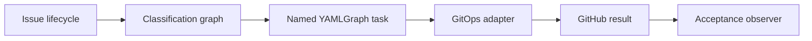

# GitClaw Architecture Refactoring Overview

**Governing architecture:** `docs/architecture.md`
**Status:** Planning overview. Every subtask requires its own researched and
judged feature request before implementation.

## Objective

Refactor GitClaw from mixed intake/verification/publication orchestration into
the architecture defined in `docs/architecture.md`:

This is a subtraction program. Each subtask introduces one owning boundary,
proves it, and retires the superseded implementation in the same judged change.
No permanent dual path, fallback harness, or shadow lifecycle is allowed.

## Constraints Across All Subtasks

- Research and judge each subtask independently.
- Write a failing boundary test before implementation.
- Preserve the trusted-trigger, credential-separation, human-merge, and
  one-task cron invariants.
- Do not repair downstream symptoms before their owner exists.
- Delete superseded code/tests/docs in the subtask that removes their final
  consumer.
- Keep semantic checks in YAMLGraph tasks/skills and mechanical checks in code.
- Use the graph-authoring adapter for every graph/prompt change.
- Record raw GitHub run/branch/PR evidence for GitOps changes.
- End each subtask with focused tests, full GitClaw tests, control-bundle
  verification, and architecture conformance notes.

## Subtask Map

| Order | Subtask | Depends on | Primary retirement |
|---:|---|---|---|
| 0 | Freeze architecture and baseline | None | Open design questions |
| 1 | Extract reconciling GitOps adapter | 0 | Publication side effects embedded in intake/current publisher flow |
| 2 | Add YAMLGraph issue classifier | 0 | Python regex command parser |
| 3 | Make issue lifecycle the request | 2 | Committed request package and hash-verification subsystem |
| 4 | Split named semantic operation tasks | 1, 2, 3 | Generic operation switch and artifact-authority gates |
| 5 | Remove invented semantic/containment gates | 4 | Heading/verdict/path authority filters |
| 6 | Simplify acceptance to observer | 1, 4, 5 | 291-line lifecycle acceptance harness |
| 7 | Dispose unused reference channel and narrow control surface | 3, 5 | Unconsumed reference package and unrelated governance costume |
| 8 | Align README, tests, and final purge | 1-7 | Mixed-design claims, orphan tests/modules |

Subtasks 1 and 2 may be researched in parallel but should not be enforced in the
same working tree/session. Subtask 4 is the integration hinge; no lifecycle
command expansion belongs before it.

## Subtask 0 - Freeze Architecture and Baseline

### Goal

Make `docs/architecture.md` the controlling responsibility contract and capture
the current divergence baseline.

### Actions

- Review architecture against issue #4/run `32443301071`/branch
  `gitclaw/issue-4-plan`.
- Add a lightweight documentation check that required architecture sections and
  component names remain present.
- Record current line/module inventory and all current architecture divergences.
- Mark README as current behavior documentation, subordinate to architecture.

### Exit Criteria

- Architecture is human-approved.
- Every later FR cites the architecture section it implements.
- No production behavior changes.

## Subtask 1 - Extract Reconciling GitOps Adapter

### Goal

Create one mechanical owner for branch, commit, push, PR, and issue-result
publication, including partial-side-effect reconciliation.

### Required Witness

Use the live branch-without-PR state from issue #4 as RED:

- branch `gitclaw/issue-4-plan` exists;
- PR does not;
- issue comment does not;
- rerun must create the missing PR/comment without duplicating the branch or
  commit.

### Actions

- Define the minimum mechanical task result GitOps consumes.
- Extract Git/GitHub side effects from intake sequencing.
- Implement deterministic branch/PR/comment identities.
- Reconcile every state in the architecture table.
- Make retries return existing publication results when complete.
- Remove the superseded linear publisher behavior and its tests.

### Not In Scope

- issue classification;
- semantic artifact validation;
- Plan/Judge separation; or
- acceptance rewrite.

### Exit Criteria

- GitOps has no issue-content or Markdown-semantic dependency.
- Partial publication tests cover branch-only, PR-only, and missing-comment
  states.
- Semantic task process still has no repository-write credential.

## Subtask 2 - Add YAMLGraph Issue Classifier

### Goal

Dogfood YAMLGraph for issue-command interpretation and remove the Python regex
lifecycle API.

### Actions

- Author one small classifier graph with structured operation output.
- Define supported operation enum and operation-specific input fields.
- Pass the triggering issue snapshot directly to the classifier.
- Route classification failure to factual issue/run reporting.
- Replace `parse_command()` and workflow output parsing.
- Delete regex grammar tests and add graph classification witnesses.

### Guardrail

The classifier selects a task only. It performs no task work, Git inspection,
artifact inspection, or publication.

### Exit Criteria

- Intake contains no command regex.
- Adding an operation means adding classifier/task configuration, not editing a
  Python state machine.
- Classifier graph lint and representative issue cases pass.

## Subtask 3 - Make Issue Lifecycle the Request

### Goal

Remove the duplicate committed request record and use the GitHub issue/event as
the request lifecycle.

### Actions

- Pass repository, issue number, event/run identity, and issue snapshot to the
  selected task without committing them.
- Remove request-file creation from intake.
- Remove request hash propagation and repeated verification.
- Delete `tools/request_contract.py` and its tests after the final consumer is
  gone.
- Ensure product PRs cannot include intake bookkeeping.
- Preserve exact diagnostic input in run evidence when needed.

### Exit Criteria

- No `features/issue-*/request.json` is created.
- Intake performs no Git commit.
- Plan PR changed files contain only task output, never request bookkeeping.

## Subtask 4 - Split Named Semantic Operation Tasks

### Goal

Replace the generic operation switch with independent YAMLGraph tasks whose
skills own semantics.

### Required Operations

- Plan: issue -> feature request only.
- Judge: feature request -> judgement only.
- Enforce: selected plan/judgement -> implementation result.
- Review: PR head + governing inputs -> review.
- Test: PR head -> test evidence, no file change.
- Run: PR head + graph path + expected outcome -> lint/run evidence, no file
  change.

### Actions

- Define each task's inputs, outputs, and failure result.
- Use existing mirrored skills/adapters where they fit.
- Route graph/prompt work through the authoring adapter.
- Remove operation branching from `prompts/generic.yaml` and
  `executor_contract.verify()`.
- Keep implementation PR unmerged; humans merge.

### Exit Criteria

- Plan no longer invokes Judge.
- Judge/Test/Run are first-class tasks, not parser special cases.
- Each task runs independently from a normal checkout with named inputs.

## Subtask 5 - Remove Invented Semantic and Authority Gates

### Goal

Delete deterministic checks that duplicate semantic skills or infer authority
from file formats/paths.

### Candidate Retirements

- required FR heading checks;
- verdict-line and first-line review checks;
- authority/implementation path classification;
- mixed-artifact semantic rejection;
- platform path containment presented as a security boundary; and
- authoring-report promotion hidden inside generic verification.

### Actions

- Inventory each gate and identify its semantic task owner.
- Move necessary semantic validation into the task/skill prompt and evidence.
- Retain only mechanical checks justified by `docs/architecture.md`.
- Delete `tools/contain.py` and remaining `executor_contract.py` surfaces when
  their final consumers are removed.

### Exit Criteria

- Deterministic code does not parse Markdown semantics.
- No Python component classifies artifact authority.
- Credential separation and Git identity checks remain mechanically enforced.

## Subtask 6 - Simplify Acceptance to Observer

### Goal

Replace the 291-line lifecycle harness with a small observer.

### Observer Contract

For one test case:

1. create the issue in the operator-supplied repository;
2. wait for its workflow;
3. print/store issue URL, run URL/conclusion, linked PR, and changed files; and
4. compare the external conclusion with the declared expectation.

### Actions

- Remove classification, authority merges, semantic file gates, skip
  propagation, and GitOps reconciliation from acceptance.
- Express multi-phase scenarios as independent test cases and explicit operator
  or product lifecycle transitions.
- Preserve issue #4 evidence as the regression seed.
- Delete the current harness rather than wrapping it.

### Exit Criteria

- Acceptance contains no lifecycle state machine.
- Acceptance performs no merge and no semantic artifact inspection.
- Script size decreases substantially as a consequence of ownership, not a line
  budget.

## Subtask 7 - Dispose Reference Channel and Narrow Control Surface

### Goal

Remove unconsumed capability machinery and distinguish task runtime from copied
framework governance.

### Actions

- Identify a current consumer for reference sets. If none exists, delete
  `tools/reference_assets.py`, intake staging, and focused tests.
- Inventory the minimum skill/adapter files required by named tasks.
- Keep executable provenance guarantees for retained runtime files.
- Remove mirrored doctrine that has no GitClaw task consumer.
- Keep local adaptations documented only for retained files.

### Exit Criteria

- Every retained reference or bundle file has a named task consumer.
- Control-bundle verification proves the runtime closure, not an imported
  governance snapshot.

## Subtask 8 - Align README, Tests, and Final Purge

### Goal

Make the public template describe the implemented architecture and delete all
superseded surfaces.

### Actions

- Rewrite README execution/trust sections to match `docs/architecture.md`.
- Replace tests that freeze old file shapes with boundary tests.
- Remove orphan modules, prompts, tests, reports, branches, and issue fixtures.
- Re-run repository-hygiene scan and full acceptance observer.
- Record before/after production and test inventory.

### Exit Criteria

- README, architecture, implementation, and tests tell the same story.
- No current file describes request packages, regex lifecycle grammar, semantic
  content gates, mixed intake/GitOps, or acceptance-owned lifecycle state.
- Full suite, named task smokes, GitOps reconciliation witnesses, cron smoke,
  and observer acceptance pass.

## Retirement Ledger

Each subtask FR must carry this table and update it before authority is granted:

| Existing surface | Keep | Replace | Retire in this subtask | Reason |
|---|---|---|---|---|
| | | | | |

An empty retirement column requires explicit justification. New components that
only wrap old components do not satisfy retirement.

## Program Completion

The refactoring program is complete when:

1. every component in `docs/architecture.md` has one implementation owner;
2. all Current Divergences are removed or the architecture is deliberately
   amended and re-approved;
3. issue #4's branch-without-PR state reconciles through GitOps;
4. Plan, Judge, Enforce, Review, Test, and Run execute as independent named
   tasks;
5. intake performs no Git operation;
6. deterministic code performs no semantic artifact inspection;
7. acceptance is only an observer; and
8. cron remains one direct YAMLGraph command.

The final subtask adds a metacognitive reflection comparing the resulting shape
to the architecture and plants a seed for the next simplification.